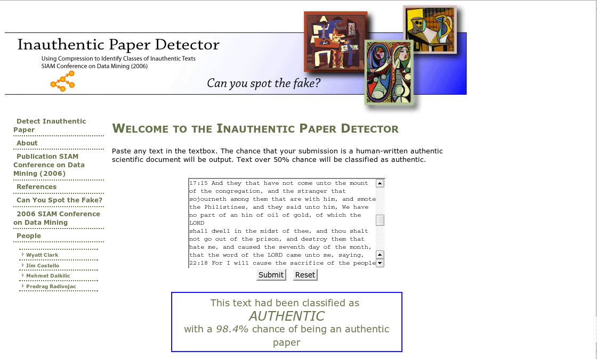

# Babbler
An AI tool that finds patterns in streams of data, and generates data of the same form.

## Caveats
* The code hasn't been touched in ~11 years.  It was a work in progress.  I wouldn't write it the same way today.
* I'm releasing it as open-source, if anyone is interested in extending it or experimenting with it.  
* I learned about Markov chains while building this, so the implementation might be non-standard.

## Applications
* Text Generation (Babbling)
* Text identification
* Changing existing text to match a certain writing style (style impersonation)
* Data compression

Most of these applications are inherent to any tool that represents data in this fashion.  These were not intended features, but result from the nature of the tool. This type of tool is also used for speech recognition and text auto-complete.  

This code, in its current form, only learns then babbles.  Other versions of the code, such as the compression tests, might be integrated in the future.

## Quick example output

### Single source of text
##### Input:  
	King James Bible (Project Gutenberg)
##### Output:  
```
2:19 And Peter said, Blessed is that great glory of the son of Jezreel of his charge of the body; is Lord GOD;
Behold, with me that pass in thy sight.

1:10 Then did the angel that thou hast enlarged my strength faileth.

2:25 And the children of Israel shall be satisfied with bread of his servants the prophets, and the high places which she had brought them into the land which I have given them that despiseth his way into the hand of the king of Babylon, and he shall come up to the house of the LORD.
```

### Multiple sources of text
##### Input:  
	First 200 MB of project Gutenberg (entire corpus)
##### Output:  
```
The red light in the sky, and the stout gentleman present who had accompanied the prince and princess were settled by the Monthly Magazine, and all that she had said to him at the moment that he was at the back of the house, and on the following day he went to the king and the queen was a witch, and her eyes on him so that he could not see his face, as he took his seat in the House of Commons, and a mouth that was always in the same place, and the same areas of land and water, and be unclean until the even.
```

### Audio
##### Input: 
	A song by Deadmau5.
##### Ouput: 
	A repeated/looped excerpt of the Song.
<a href="com/lizakowski/tools/AI/output/Remote_Deadmau5.8khz.8bitsigned.withwhitenoise.x18.raw.wav">Link to WAV</a>.

### Words invented
Many of these derive from Babbling AP News feeds from the mid-2000's. 
* Europerate
* biotection
* processionalists
* apprecisioned
* innovatory
* visional medicarefuses
* exceptember
* reconomy
* subpoenalty
* infrastructions

## Quickstart
```
javac com/lizakowski/tools/AI/SymbolTree.java
cd com/lizakowski/tools/AI 
java  -Xmx30g -classpath ../../../../ com.lizakowski.tools.AI.SymbolTree KingJamesBible_unformatted_x2.txt
```

## Features
* Efficient data structure (custom, variable-depth Markov chain) stored in a tree format.  
* In typical usage, the Babbler looks at the world through a narrow view: just a handful of characters at a time.  Yet, it can produce reasonable-sounding text that has apparent context spanning dozens of letters, sometimes hundreds of letters.
* Output is essentially context-free.  It tends to read well, but has no meaning.  The deeper it analyzes text, the more it can appear to have meaning or context.  But there is risk of over-training - at which point it just generates the input text repeatedly.  To avoid this, the tree is evaluated at multiple depths simultaneously.  The deeper depths are given more weight, but shallow depths, including just the 1st-level letter frequencies, can still influence the output.  
* This version was generalized to analyze any stream of "Symbols", and generate a similar stream of those symbols.  These could be alphabetic letters, or any object.  UTF-8 wasn't a consideration when I wrote this, but it would be easy to make a "UTF8Symbol" class.


## What it doesn't do
* It does not analyze the structure of the input.  It cannot currently learn that open-parenthesis are followed by closed-parensthesis. So, if HTML or source code is analyzed, the results will have many syntax errors.

### Text compression?
Yes. The efficient encoding into a markov tree can be used to replace strings of letters with their tree coordinates.  This is similar to existing compression methods, but uses a different tree structure. This was tested as pre-processor for compression, and IIRC, the performance was better than gzip, but not necessarily better than bzip2.

Babbling can also be viewed as decompressing a file of random bytes.  The random data encodes sequences of characters that are statistically likely.  

### Identification?

When a text is compressed by the database that matches, it will compress best.  If the database mismatches, the compression will be lower.  Measuring how well it compresses can indicate if the writing style matches.

In 2006, I found an online essay-grading tool at a University.  I submitted some babbled / context-free versions of text, and the resulting text received a high score.  



## Performance
While the data structure was designed to be efficient, the current implementation holds the entire structure in RAM simultaneously.  The implementation focus was function more than performance.  The part of the code that is of most interest is the data structure, and how it can be used.

## License
MIT (see LICENSE)
